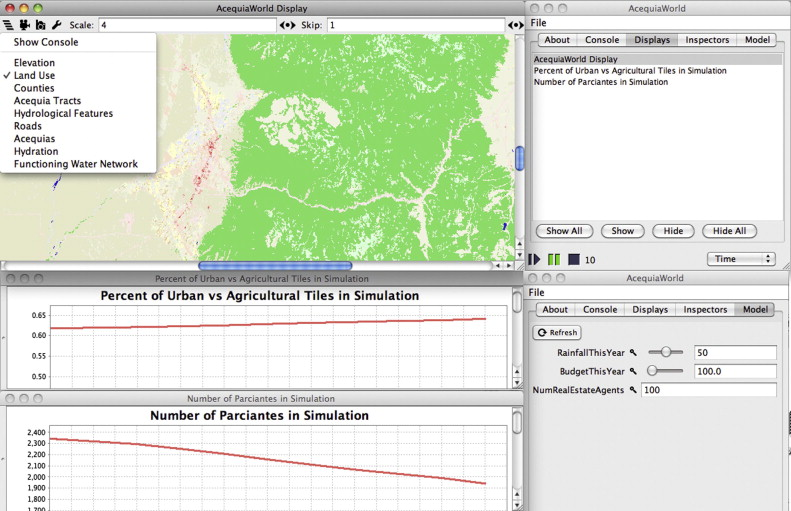

# Appendix A11 Agent-Based Modeling for Community Resource Management

## Introduction

Wise and Crooks (2012) developed an agent-based model in MASON to explore the complex social interactions of water management, which involves landowners (i.e. farmers) collectively maintaining and managing ditches which distribute water among the properties in Taos, New Mexico. This system of the physical ditches and the maintaining organisation together is known as an acequia, and the landowners who maintain it are called Parciantes. Acequias are interesting to researchers because of the developed common property regimes they require to function. The water carried by the ditches is a shared resource, and the complex management system of the acequia has evolved to avoid a ''*tragedy of the commons*'' with regard to natural resources in the sense that it prevents the resource from being overused or under-maintained to the detriment of everyone. In this paper, Wise and Crooks (2012) investigate the interactions and cumulative impact of the physical water system, local social and institutional structures which regulate water use, and the real estate market on the sustainability of traditional farming in the region. A snapshot of the GUI of the model during a specific simulation is shown in the Figure below. The results from their model show that depending on the future patterns of weather and government regulations, acequia-based farming may continue at near current rates, shrink significantly but continue to exist, or disappear altogether.

Graphical user interface of the Acequia-based agriculture model showing the spatial environment including land-use and charts recording the number of farmers (parciantes) and urban versus agricultural percentages during a representative model run.

**Model Available at:** <http://www.css.gmu.edu/Acequias>Alternatively for a more upto date version of the model see: <https://github.com/eclab/mason/tree/master/contrib/geomason/sim/app/geo>.

**Reference:**

Wise, S. and Crooks, A.T. (2012), [Agent Based Modelling and GIS for Community Resource Management: Acequia-based Agriculture](https://www.sciencedirect.com/science/article/pii/S0198971512000804), Computers, Environment and Urban Systems, 36(6): 562-572.

Click on the image below to see a YouTube movie of the model:

