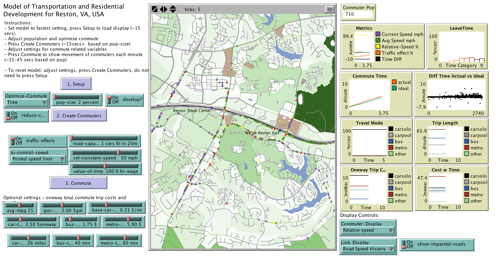

# Appendix A10 - Modeling Transportation and Development for Reston, VA

## Introduction

Swartz (2015) developed an spatially explicit agent-based model in NetLogo as shown in Figure below to explore how altering the mode of transportation for impacts individual agents commuting behaviour in the suburban Washington DC area of Reston, Virginia, USA. The model generates typical traffic conditions for the area and explores the potential impact on residential development on travel times as more residents move into the area including identifying bottlenecks at major intersection from such growth.

Graphical user interface of the Reston commuter model, from left to right: Input parameters, visual display and model outputs during a representative model run.

**Model Available at:** [Here.](Reston_NetLogo_Model_and_Data.zip)

**Reference:**
Swartz, M. (2015), *Evaluating Impacts Of Future Development On Commuters: A Modelof Transportation and Development for Reston, VA*, Master Project, Master of Arts in InterdisciplinaryStudies with a Concentration in Computational Social Science, George MasonUniversity, Fairfax, VA.

Click on the image below to see a YouTube movie of the model:

