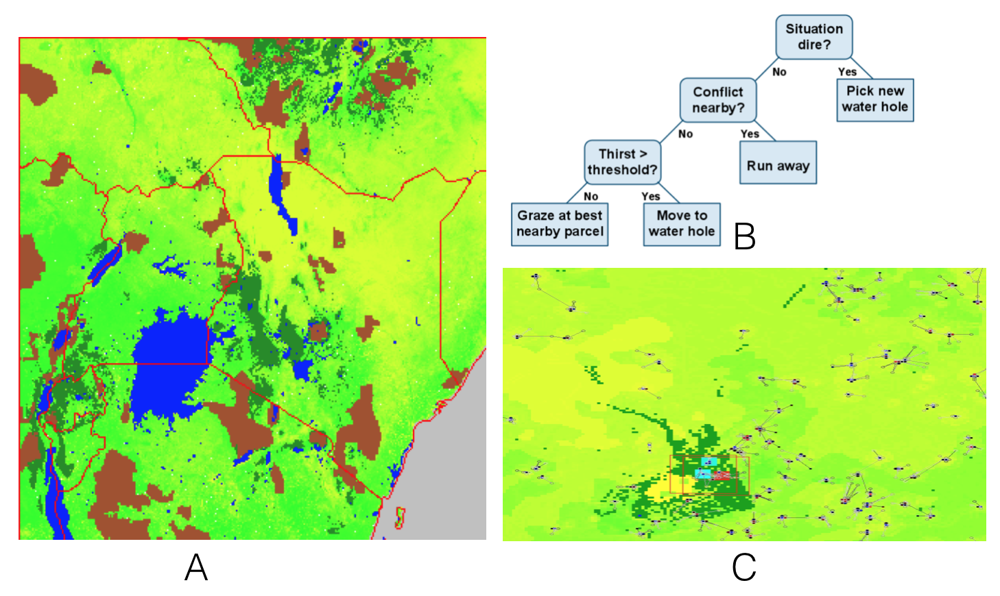

# Appendix A14 - RiftLand: Analyzing Conflict, Disasters, and Humanitarian Crises in East Africa

## Introduction

The RifLand Model (Cioffi-Revella et al., 2011; Kennedy et al., 2014) was developed in MASON and utilises GeoMason to simulate coupled social and natural systems. The model is based on several countries in East Africa (roughly 2.6 million km2) including Kenya, Uganda, Rwanda, Burundi, and their respective borderlands with Somalia, Ethiopia, Sudan, Democratic Republic of Congo, and Tanzania as shown in the Figure below. Its purpose was to explore how climate change could impact the inhabitants (herders, farmers, urban populations) of this region including herders and farmers including their decision making (using a fast and frugal decision tree) as shown in Figure B and how this results in movement and conflict between people (Figure C).

The Rifland Model of parts of East Africa: (A) The modelled region where yellow to green represents vegetation, Blue is fresh water, gray is Indian Ocean and brown are nature reserves. (B) is an example of decision making of the household herding model and (C) shows in a zoomed in section of model where individual herders and farmers are shown.

**Model Available at:** <https://github.com/eclab/mason/tree/master/contrib/geomason/sim/app/geo>. 

**References:**

Cioffi-Revilla, C., Gulden, T., Kennedy, W. and Coletti, M. (2011), *MASON RiftLand: An Agent Based Model for Analyzing Conflict, Disasters, and Humanitarian Crises in East Africa*, Center for Social Complexity, Krasnow Institute for Advanced Study, George Mason University: Working Paper, Fairfax, VA.

Kennedy, W.G., Cotla, C.R., Gulden, T.R., Coletti, M. and Cioffi-Revilla, C. (2014), '[Towards Validating a Model of Households and Societies of East Africa](https://link.springer.com/chapter/10.1007/978-4-431-54847-8_20)', in Chen, S.H., Terano, I., Yamamoto, H. and Tai, C.C. (eds.), *Advances in Computational Social Science: The Fourth World Congress*, New York, NY, pp. 315-328.

Click on the image below to see a YouTube movie of the model:

