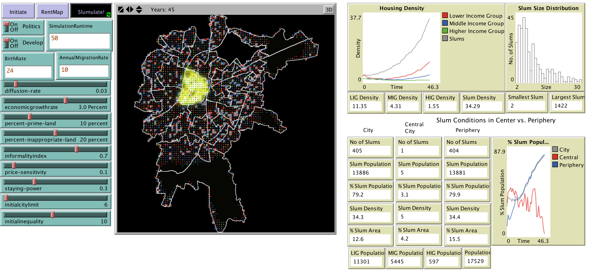

# Appendix A13 - Exploring the Growth of Slums

## Introduction

More than 900 million people or one third of the world's urban population lives in either slum or squatter settlements (UN-Habitat, 2003). Urbanisation rates in developing countries are often so rapid that formal housing development cannot meet the demand resulting in the rapid proliferation of slums. In order to understand this phenomena, Patel et al. (2012) first developed a conceptual model of the basic mechanisms that are suggested to cause the growth of slums before developing a more spatially explicit agent-based model in NetLogo to explore how slums form and expand in Ahmedabad, India where 41% of its population lives in slums (Patel et al., 2018). The GUI of the Slumulation model is shown in the Figure below. Their model shows how the collective effect of many interacting inhabitants of slums as well as non-slum actors (e.g. local government, developers) generate the emergent structure of slums at the macro scale. 

Graphical user interface of the Slumulation Model including input praters (left), the spatial environment  based on Ahmedabad, India (centre) and various output parameters (right).

**Model Available at:** <http://www.gisagents.org/p/an-agent-based-modeling-approach-to.html>

**Reference:**

Patel, A., Crooks, A.T. and Koizumi, N. (2018). '[Spatial Agent-based Modelling to Explore Slum Formation Dynamics in Ahmedabad, India](https://link.springer.com/chapter/10.1007/978-3-319-59511-5_8)' in Thill J.C. and Drajicavic, S. (eds.), *Geocomputational Analysis and Modeling of Regional Systems*, Springer, New York, NY, pp 121-141.

Click on the image below to see a YouTube movie of the model:

