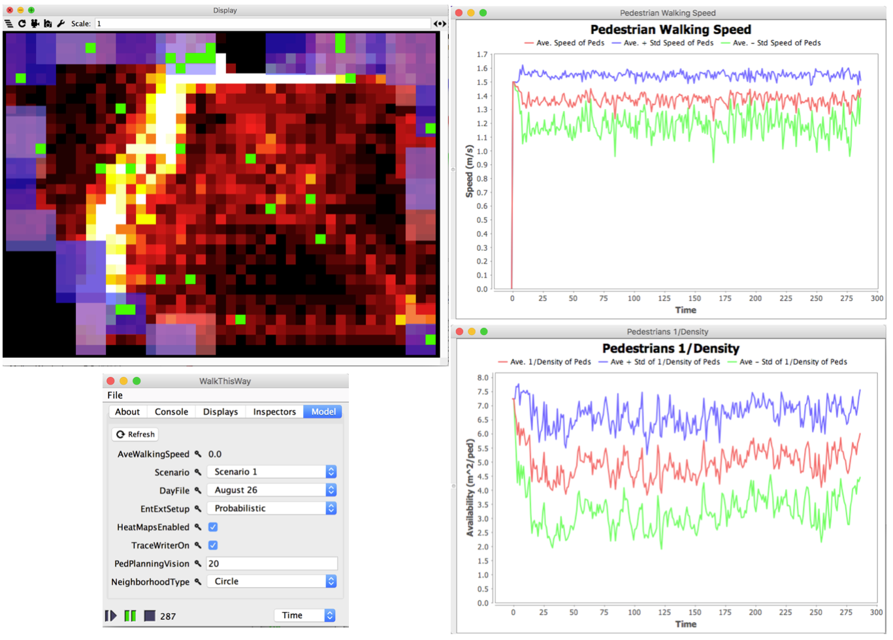

# # Appendix A7 - Walk this Way

## Introduction

Pedestrian modelling has been traditionally faced with the challenge of collecting data to calibrate and validate such models of pedestrian movement. With the increased availability of mobility datasets from
video surveillance we are now presented with the opportunity to change the way we build pedestrian models. Using MASON, Crooks *et al.* (2015) demonstrated how real scene activity information can be harvested and used in agent-based models as shown in the Figure below to better inform pedestrian models and enhance their predictive capabilities.

Graphical user interface of "*Walk this Way*" pedestrian model. Clockwise from top left:
Spatial environment, charts recording average walking speed, crowd density and model parameters.

**Model Available at:** Model Available at: <https://www.openabm.org/model/4706/>. Alternatively for a more upto date version of the model see: <https://github.com/eclab/mason/tree/master/contrib/geomason/sim/app/geo>.

**Reference:**

Crooks, A.T., Croitoru, A., Lu, X., Wise, S., Irvine, J. and Stefanidis, A. (2015), [Walk this
Way: Improving Pedestrian Agent-Based Models through Scene Activity Analysis](http://www.mdpi.com/2220-9964/4/3/1627/htm), *ISPRS International
Journal of Geo-Information*, 4(3): 1627-1656.

Click on the image below to see a YouTube movie of the model:

