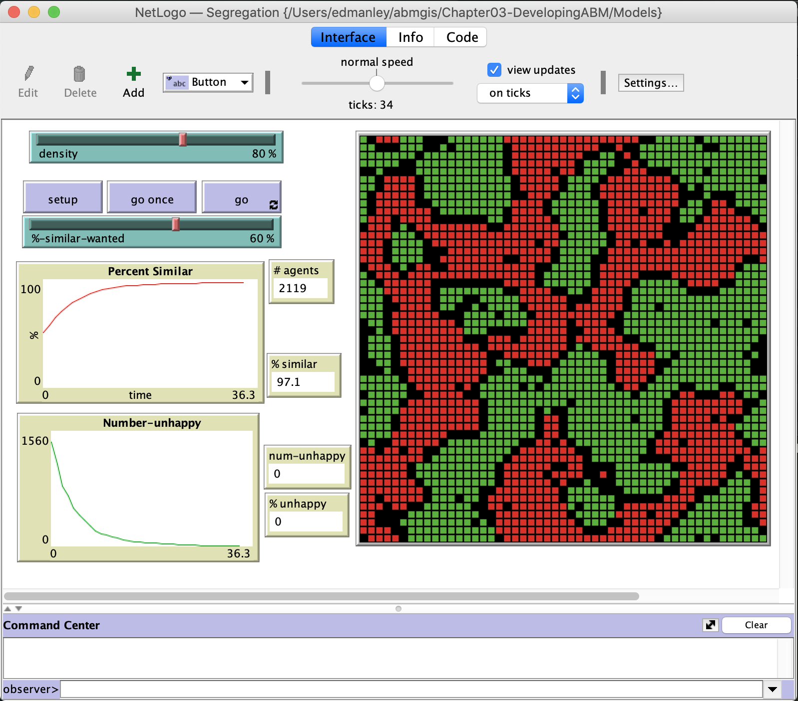

# Chapter 3 - Designing and Developing an Agent-based Model

This folder includes the accompanying resources for the chapter. For full book details, see: [http://www.abmgis.org/](http://www.abmgis.org/).

## Introduction

In this chapter we explore the questions that social scientists and geographers must consider when designing and building an agent-based model. Taking you through the complete design process, we explore the considerations required in defining a simulation _overview_, in designing the simulation _world_, the nature of agent _interactions_ with each other and the world around them, and how the _agents_ act and evolve. In the book we also look at other design frameworks and software toolkits are available to use, and their relative pros and cons. 

This chapter will introduce the core concepts and frameworks that can be used to plan, implement and disseminate geographical agent-based models.

## Tutorial / Lecture Slides

The lecture slides for this chapter are available: [Chapter3 Lecture Slides](./Chapter3.pptx).

A tutorial for this chapter, where we apply the design process outlined fully in the book, can be found here: [Chapter3 Tutorial](./Chapter3_Tutorial.pptx). This tutorial involves the development of the [Segregation Model](Models/Segregation.nlogo), shown below.

For full details about the book, see: [http://www.abmgis.org/](http://www.abmgis.org/).

