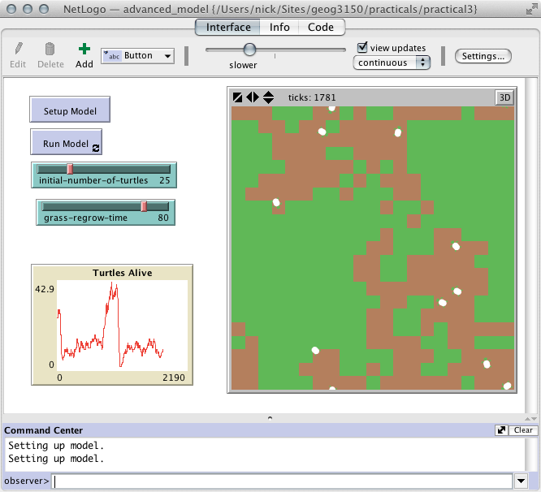

# Chapter 4 - Building Agent-Based Models with NetLogo

This chapter provides an overview of the programming language and concepts that are used within [NetLogo](https://ccl.northwestern.edu/netlogo/). NetLogo basics, such as how to create a simple environment, commands and procedures, are presented with step by step instructions for creating a simple model. Following this basic model, more advanced features are introduced. The overall aim of this chapter is to provide an understanding of the main components that make a NetLogo program. Subsequent chapters build upon the basics presented here.

There are two models available in the [Models](./Models) directory:

 1. [first_model.nlogo](./Models/first_model.nlogo) presents the simple model that the chapter discusses first;

 2. [advanced_model.nlogo](./Models/advanced_model.nlogo) presents the more complicated model, with grass that can be eaten (see the image below).

For full book details, see: [http://www.abmgis.org/](http://www.abmgis.org/).

