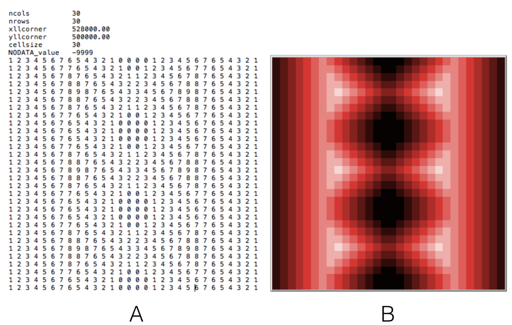
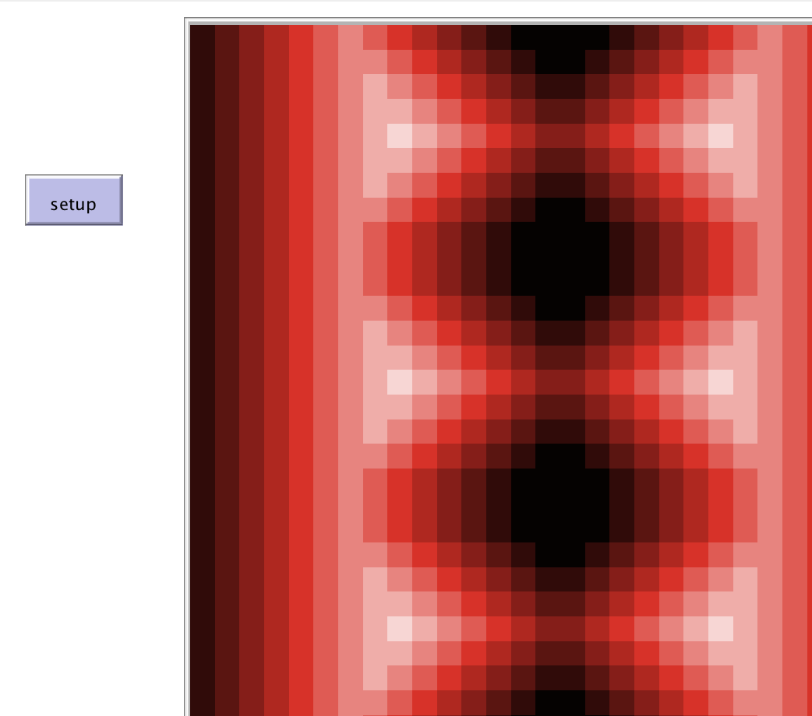

# ImportRasterSample

This folder includes the accompanying resources for the chatper. For full book details, see: [http://www.abmgis.org/](http://www.abmgis.org/).

## Introduction

An Example of reading in a raster data and creating a landscape. In the figure below (A) is the original ASCII file from a GIS. (B): is the resulting space created in NetLogo.

Graphical User Interface of the Model: 

