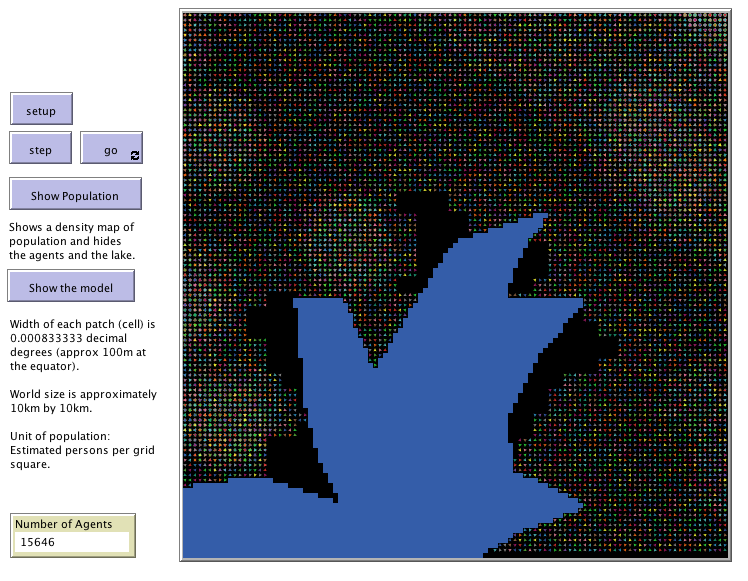

# UgandaExample

This folder includes the accompanying resources for the chatper. For full book details, see: [http://www.abmgis.org/](http://www.abmgis.org/).

## Introduction

An example of using open data for the initialisation of an agent-based model.

Whats in the folder: 

* **The model**: [map.nlogo](map.nlogo)
* **Orignal data** [UgandaExample_Original_GIS_Data.zip](UgandaExample_Original_GIS_Data.zip) 
* **MXD Files**: [mdx_files.zip](mdx_files.zip)

