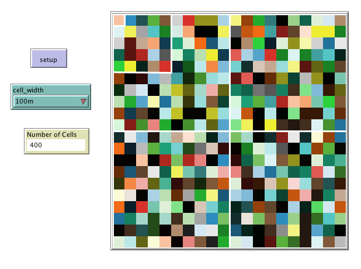

# PatchSize Example

This folder includes the accompanying resources for the chatper. For full book details, see: [http://www.abmgis.org/](http://www.abmgis.org/).

## Introduction

The **PatchSize** example, illustrates how vector data can be dispalyed but at the same time set the patch size in NetLogo to the correct scale. The Shapefile simply contains some overlapping squares with known side lengths (100m, 500, and 1km). The number of patches, and the size of the patches, can then be configured manually to find the patch size that corresponds to the same dimensions as the squares in the GIS data which is established through trail-and-error.

Below is the graphical user interface of the model: 

