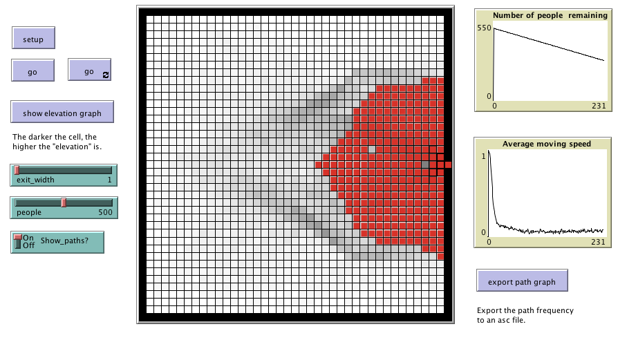

# Pedestrian_Model_Grid

This folder includes the accompanying resources for the chatper. For full book details, see: [http://www.abmgis.org/](http://www.abmgis.org/).

## Introduction

A simple pedestrian evacuation model where agents are exiting a room, taking the shortest path (calculated via a cost surface). The idea behind this model is to highlight how changing the width of the exit (i.e. the door) can impact on the evacuation time.

Below is the graphical user interface of the model: 

Click on the image below to see a YouTube movie of the model:

