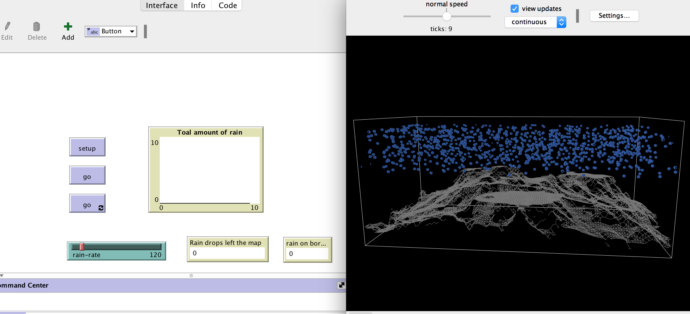

# Rainfall 3D

This folder includes the accompanying resources for the chatper. For full book details, see: [http://www.abmgis.org/](http://www.abmgis.org/).

## Introduction

This model extends the [**Rainfall Model**](../Rainfall) by using a text file to create a 3D terrian. In order for this to work we have a breed called ```stayers``` which ```spout``` from the patches which have infromation from the text file (and inherit the inforamtion from them). These ```stayers``` are then linked togehter to for the 3D terrain. 

Below is the graphical user interface of the model: 




Click on the image below to see a YouTube movie of the model:

[](http://www.youtube.com/watch?v=7O2fSZ0OwuE "Rainfall 3D")

## Links

NetLogo 3D <https://ccl.northwestern.edu/netlogo/docs/3d.html>