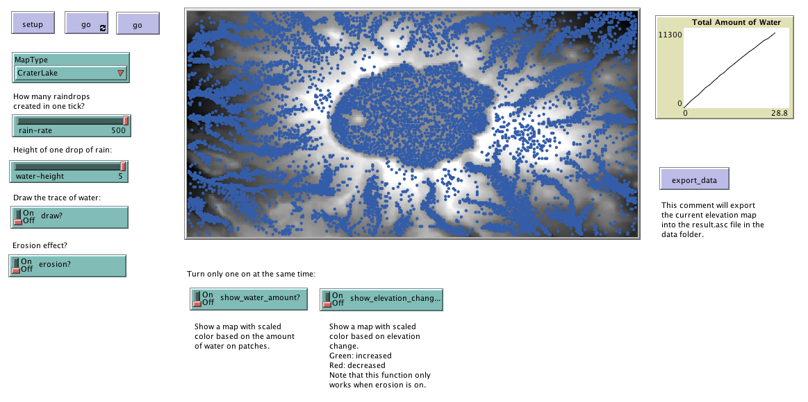

# Rainfall Model

This folder includes the accompanying resources for the chatper. For full book details, see: [http://www.abmgis.org/](http://www.abmgis.org/).

## Introduction

The model demonstrates how rain can fall from the sky and flow to lower elevations by using a digital elevation model (DEM) -- i.e. a raster map where each pixel represents a height value.

If the water reaches a point from which it can flow no further (e.g. a depression) it pools until the depression if full, at which point the water will flow again. 

Additional features include allowing for erosion and exporting the altered landscape. 

Below is the graphical user interface of the model: 

Click on the image below to see a YouTube movie of the model:

## Similar Models

The model was inspired by the from NetLogo's Grand Canyon Model <http://ccl.northwestern.edu/netlogo/models/GrandCanyon>.