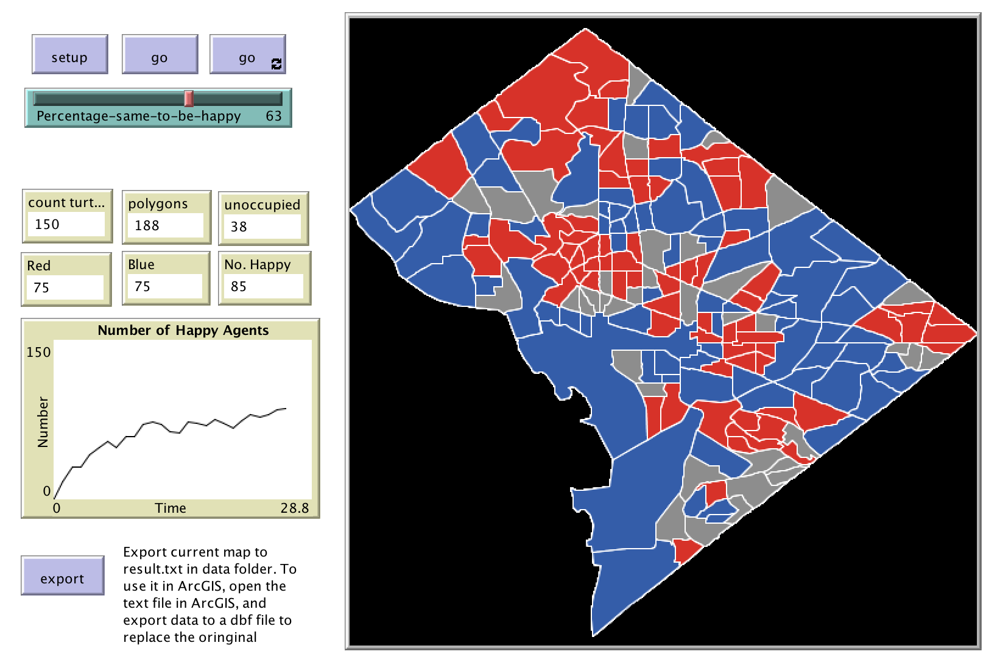

# Segregation_DC_1

This folder includes the accompanying resources for the chatper. For full book details, see: [http://www.abmgis.org/](http://www.abmgis.org/).

## Introduction

This is a segregation model built using the map of Wahington DC. There is one agent in each polygon. They are either blue or red. They look at the color of their geometrical neighboring polygons and decide whether they are happy or not. There is a slider to adjust how much percentage of same color neighbors they need to be happy. If one is not happy, it will move to an unoccupied neighboring polygon.

It is tricky to find the geometrical neighbors of each polygon in NetLogo, since it does not have this function. A work around was to use the Polygon Neighbors function in ArcGIS 10.2 to create a text file which maps each polygon to its neighbors (a similar method would be to use [GeoDa](https://spatial.uchicago.edu/software) and create a GAL file (a text file which records the the object and the number of neighbours that each object has).

Below is the graphical user interface of the model: 

Click on the image below to see a YouTube movie of the model:

