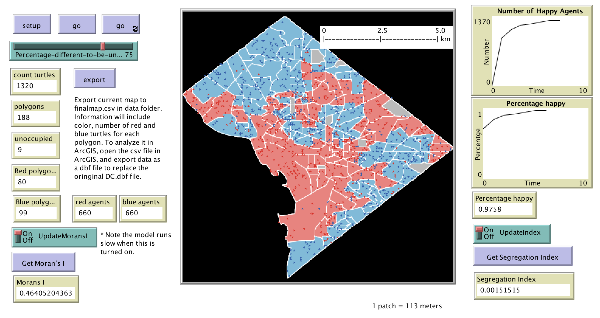

# Segregation_DC_2

This folder includes the accompanying resources for the chatper. For full book details, see: [http://www.abmgis.org/](http://www.abmgis.org/).

## Introduction

Builing on [**Segregation_DC_1**](../Segregation_DC_1) this model uses attrubte information from the shapefile's .dbf i.e. the ```POPU``` colum to create agents.

In each tick, agents assess two neighborhoods (local 8 neighbours and also the the polygon its in) and decides whether they are happy or not. If either neighborhood has different neighbors more than the specified percentage to be unhappy, the agent will move to an unoccupied patch in a polygon that is unoccupied or has the same color with it. 

The colors of the polygons are decided by the majority of agents living in each of them, and the colors can change every tick.

There are also functions to export the map to a GIS, and to calculate the Moran’s I.


Below is the graphical user interface of the model: 




Click on the image below to see a YouTube movie of the model:

[](http://www.youtube.com/watch?v=WR-oQGi7D1Y "Segregation_DC_2_GUI")