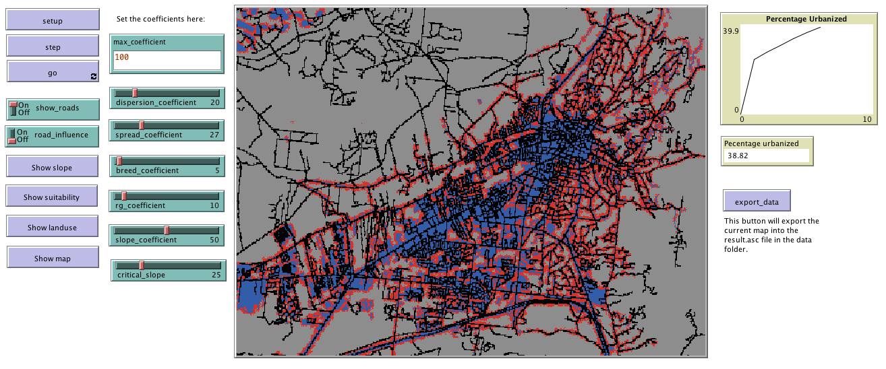

# UrbanGrowth Model

This folder includes the accompanying resources for the chatper. For full book details, see: [http://www.abmgis.org/](http://www.abmgis.org/).

## Introduction

An example of setting the patch size of NetLogo [PatchSize](Models/PatchSize)

Graphical User Interface of the Model: 

