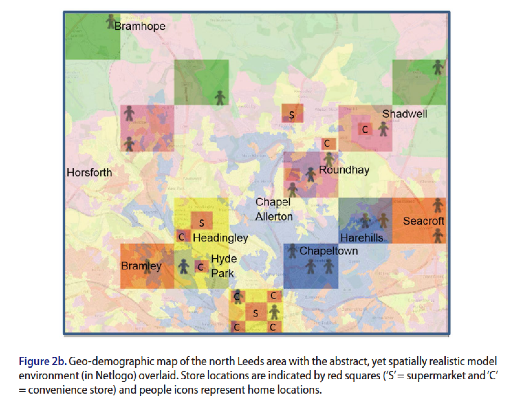

# Evaluating the Potential of Agent-based Modelling to Capture Consumer Grocery Retail Store Choice Behaviours

## Introduction

**Model name**: [Store_choice_model.nlogo](Store_choice_model.nlogo)

The model by Sturley et al. (2018) was built to simulate different patterns of consumer behaviour within a city using probabilistic rules. Below is the graphical user interface of the Store_choice_model.nlogo model.

## Reference:

**Sturley, C., Newing, A., & Heppenstall, A. (2018)**. [Evaluating the potential of agent-based modelling to capture consumer grocery retail store choice behaviours](https://www.tandfonline.com/doi/abs/10.1080/09593969.2017.1397046). *The International Review of Retail, Distribution and Consumer Research*, 28(1), 27-46.