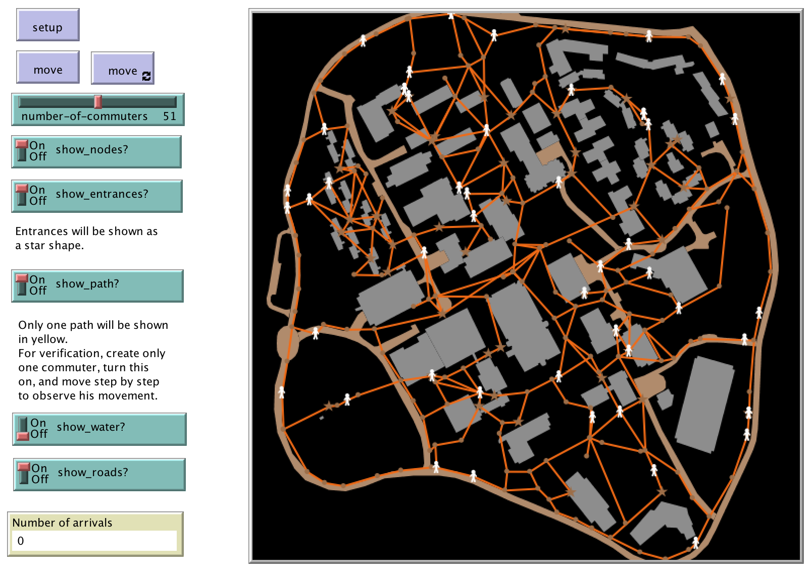

# GMU-Roads Model

## Introduction

This model is a simple path-finding model using an A-star algorithm to find the shortest path between two points.

In the beginning, each agent (commuter) randomly selects a destination and then identifies the shortest path to the destination. 

The A-star algorithm is used to find the shortest path in terms of distance. The commuters move one node in a tick. When they reach the destination, they stay there for one tick, and then find the next destination and move again.

A variation of this can be found in [Appendix A10 - Modeling Transportation and Development for Reston, VA](/AppendixA/Reston).

To get an idea of the model click on the image below to see a Youtube movie of the model:

Or visit the movie directly <https://youtu.be/NGNCenhcUu4>