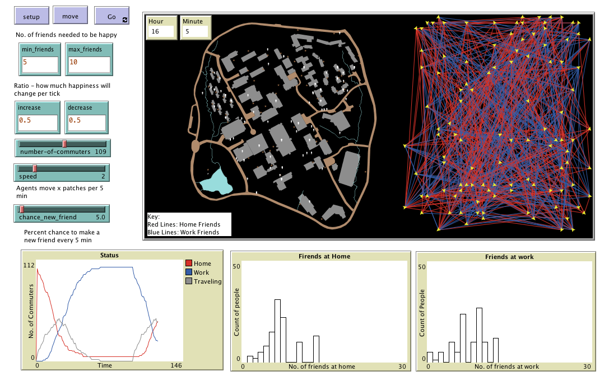

# Chapter 8 - Networks

## Introduction

This model extends the [GMU-Roads Model](../GMU-Roads) to also add 

The NetLogo links documentation <https://ccl.northwestern.edu/netlogo/docs/programming.html#links> is very comprehensive and worth reading

NetLogo’s Network Extension toolkit <https://github.com/NetLogo/Network-Extension>

upto Box 8.3

Wilensky, U. (2005). NetLogo Preferential Attachment model. http://ccl.northwestern.edu/netlogo/models/PreferentialAttachment. Center for Connected Learning and Computer-Based Modeling, Northwestern University, Evanston, IL.