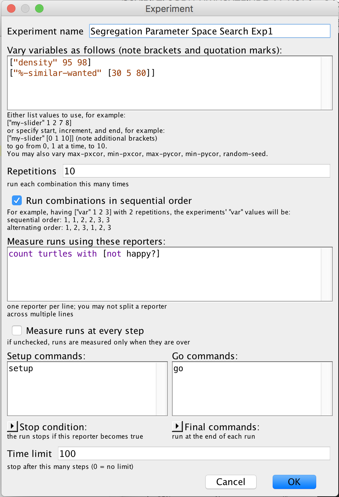

# BehaviorSpace Example: Using the Segregation Model

## Introduction

[BehaviorSpace](https://ccl.northwestern.edu/netlogo/docs/behaviorspace.html) in NetLogo offers an easy-to-use tool for simulating the effect of different parameter values on model outcomes.

In this example we take [NetLogo's Segregation model](http://ccl.northwestern.edu/netlogo/models/Segregation) and simply add varaibles and commands to be carried out to explore the parameter space (as shown in the figre below).

To run BehaviorSpace:

* Open the model in NetLogo
* Select "Tools" -> BehaviorSpace -> press "Run"
* To edit edit the experiment press "Edit"

## Reference

Wilensky, U. (1997). NetLogo Segregation model. <http://ccl.northwestern.edu/netlogo/models/Segregation>. Center for Connected Learning and Computer-Based Modeling, Northwestern University, Evanston, IL.
