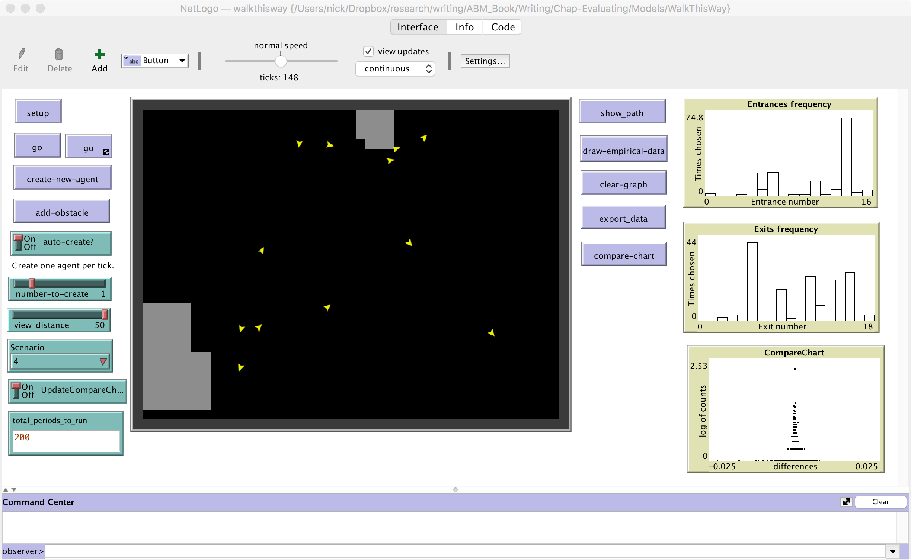

# Walk this Way Model

## Introduction

The original model was published by Crooks *et al*. (2015) and the model itself was created in MASON ([See Appendix A7 for the orignal MASON model and more details](/abmgis/tree/master/AppendixA/Walk))

Here we show the model reimplemented in NetLogo. The aim of the model was to simulate the movement of people as they cross a environment (i.e. a scene) and to calibrate the model against observed pedestrian movement paths derived from trajectory data extracted from CCTV data.

## References
For the oringal model and more information see: 

**Crooks, A.T., Croitoru, A., Lu, X., Wise, S., Irvine, J. and Stefanidis, A. (2015)**,  [Walk this Way: Improving Pedestrian Agent-Based Models through Scene Activity Analysis](http://www.mdpi.com/2220-9964/4/3/1627/htm),  *ISPRS International Journal of Geo-Information*, 4(3): 1627-1656