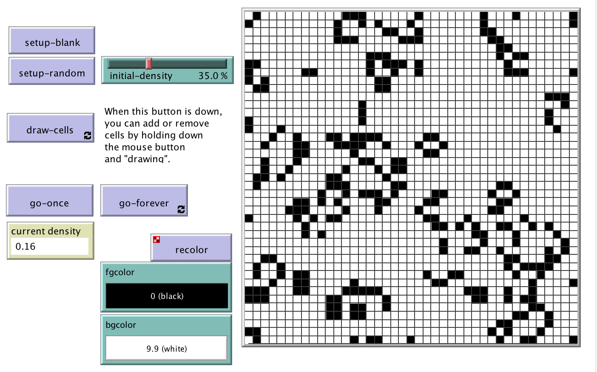
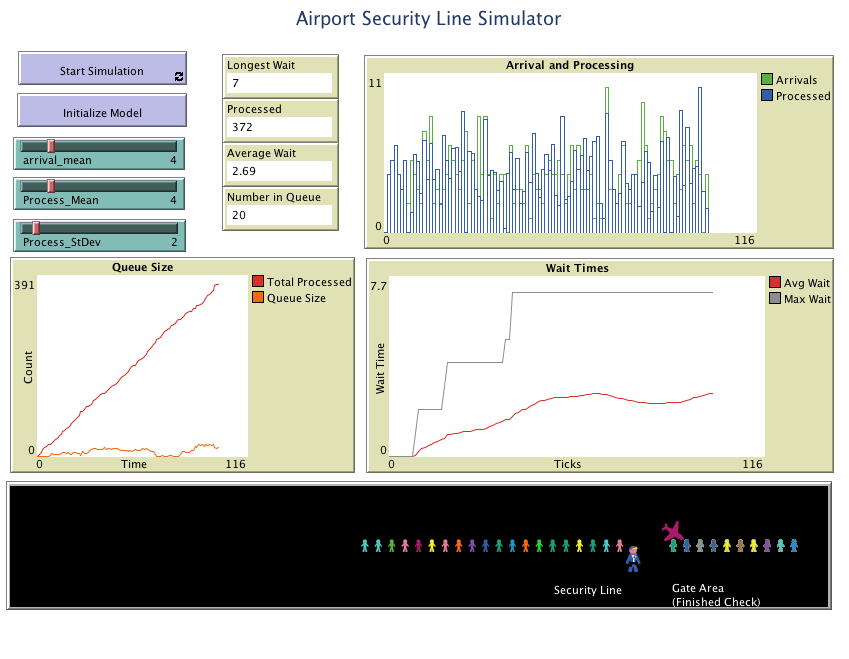

# Example Models

This folder includes the accompanying resources for the chatper. For full book details, see: [http://www.abmgis.org/](http://www.abmgis.org/).


To highlight some other modeling techiques in this foloder you will find three examples:

1. **A Cellular Automata** (CA) model: The Game of Life model ([CA_LifeModifed_Example.nlogo](CA_LifeModifed_Example.nlogo))
1. **A Discreet Event Simulation** (DES): [DES_Airport_Queue_Example.nlogo](DES_Airport_Queue_Example.nlogo)
1. A System Dynamics (SD) Model: [System_Dynamics_Wolf_Sheep_Predation_Example.nlogo](System_Dynamics_Wolf_Sheep_Predation_Example.nlogo)

More details about the models, references and links can be seen below.

## Modified Game of Life

The orignal [NetLogo Game of Life model](http://ccl.northwestern.edu/netlogo/models/Life) (Wilensky, 1998) was modifed to allow for gridlines to be drawn (note the ```draw-gridlines``` procedure was coppied exactly from <http://complexityblog.com/>. The code for the procedure is as follows: 

```
to draw-gridlines
  crt world-width [
    set ycor min-pycor
    set xcor who + .5
    set color 2
    set heading 0
    pd
    fd world-height
    die
  ]
  crt world-height [
    set xcor min-pxcor
    set ycor who + .5
    set color 2
    set heading 90
    pd
    fd world-width
    die
  ]
end
```

Below you can see the Graphical User Inteface (GUI) for the model (see: [CA_LifeModifed_Example.nlogo](CA_LifeModifed_Example.nlogo)) with the grid lines shown.



## Airport Security Line Simulation

The irport Security Line Simulation was created by Bybee and Eng (2012). While the orignal website cannot be directly accessed it is viewable on the [Internet Archive](https://web.archive.org/web/20160410065204/http://beyondbitsandatomsblog.stanford.edu/spring2012/assignments/assignment-4-creating-netlogo-models/airport-security-line-simulation-netlogo-abm/).
 
Below you can see the GUI for the model (see: [DES_Airport_Queue_Example.nlogo](DES_Airport_Queue_Example.nlogo)).


To get an overview of [DES_Airport_Queue_Example.nlogo](DES_Airport_Queue_Example.nlogo) model click on the image below to watch a YouTube movie:  

[](http://www.youtube.com/watch?v=NfqdJ3GRrXk "Airport Security Line Simulation")

## System Dynamics Model

Wilensky (2005) [NetLogo Wolf Sheep Predation](http://ccl.northwestern.edu/netlogo/models/WolfSheepPredation(SystemDynamics)) is shown below (see: [System_Dynamics_Wolf_Sheep_Predation_Example.nlogo](System_Dynamics_Wolf_Sheep_Predation_Example.nlogo)).


## References & Links

* **Bybee, G. and L. A. Eng (2012)**. Airport Security Line Simulation. Available at <http://beyondbitsandatomsblog.stanford.edu/spring2012/assignments/assignment-4-creating-netlogo-models/airport-security-line-simulation-netlogo-abm/> [Accessed on April, 10th, 2017].
* **Shiflet, A. B., & Shiflet, G. W. (2014).** Introduction to Computational Science: Modeling and Simulation for the Sciences. Princeton University Press, Princeton, NJ.
	* The SD SIR model can be found on the accompanying website: <https://ics.wofford-ecs.org/dynamics/NetLogo> 
* **Wilensky, U. (1998).** NetLogo Life model. <http://ccl.northwestern.edu/netlogo/models/Life>. Center for Connected Learning and Computer-Based Modeling, Northwestern University, Evanston, IL.
* **Wilensky, U. (2005)**. NetLogo Wolf Sheep Predation (System Dynamics) model. <http://ccl.northwestern.edu/netlogo/models/WolfSheepPredation(SystemDynamics)>. Center for Connected Learning and Computer-Based Modeling, Northwestern University, Evanston, IL.